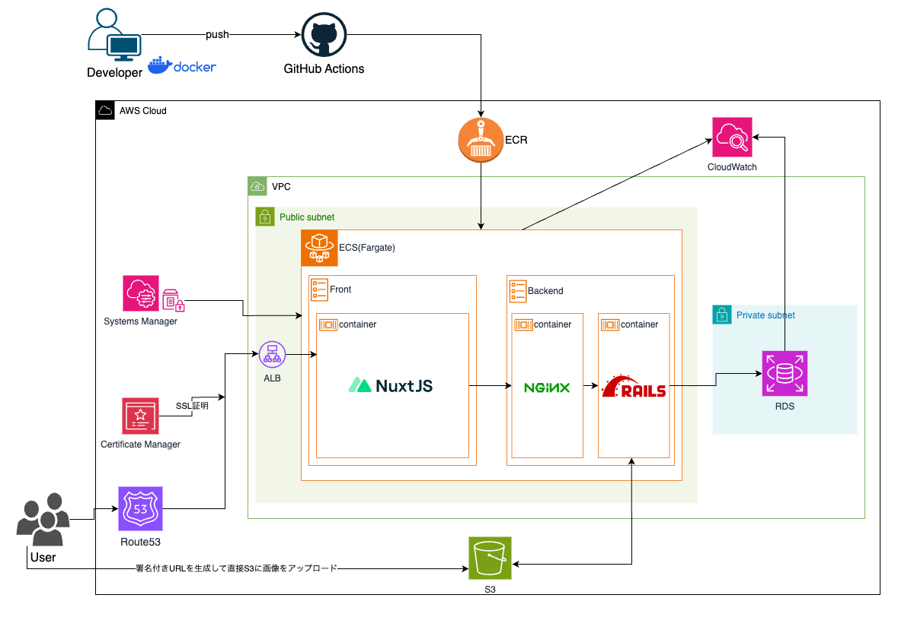
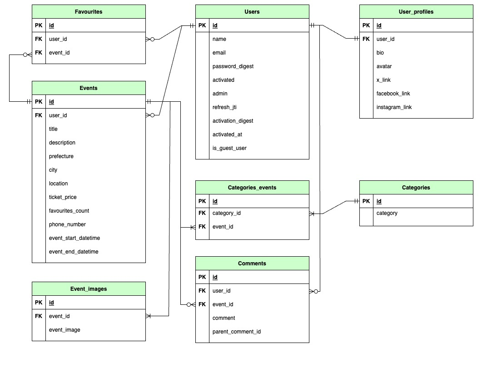

# 概要
### サービス名：みんなのイベント  
* 「みんなのイベント」は、だれでも気軽に、簡単に、地域の身近なイベントが投稿でき、だれもがイベント情報にアクセスできる、そんなイベント情報共有サイトです。  
本サイトを通じて、今まで知らなかった地域の催しが知れたり、参加してみることでコミュニティの輪が広がったり、地域の賑わいづくりの一助となれたら、という想いで制作しました。
* サービスURL：https://minnanoevent.com/
* かんたんログインで会員登録せずに機能をお試しいただけます。レスポンシブ対応のため、PCでもスマートフォンでもご利用いただけます。

* バックエンドリポジトリはこちらです。  
https://github.com/shtan14/minnanoevent_api

 

# 主要機能

| 一覧表示| かんたんログイン |
| ---- | ---- |
|  |  |

| プロフィール編集| 検索 |
| ---- | ---- |
|  |  |

| コメント投稿| イベント投稿 |
| ---- | ---- |
| |  |

 

# 機能一覧
* 会員登録（メール認証） / 退会
* ログイン（JWT認証） / かんたんログイン / ログアウト
* イベント一覧表示 / カテゴリー別イベント一覧表示
* 個別イベント詳細表示 / 個別イベントのコメント表示
* ユーザー詳細ページ表示
* ユーザーが主催するイベント一覧表示
* フリーワード検索 / 日付検索
* レスポンシブデザイン
* トースト表示 / エラー画面表示
* 無限スクロール（vue-infinite-loading）  
* プロフィール編集（アバター画像、自己紹介文、SNSリンク）
* お気に入り追加・削除
* お気に入りに追加したイベント一覧表示
* コメント投稿・削除
* イベント投稿・編集・削除

 

# 技術一覧
* バックエンド
  * Ruby 3.2.2
  * Ruby on Rails 7.0.5
  * RSpec / RuboCop
  * nginx / puma
* フロントエンド
  * Nuxt.js 2.17.2
  * Vue.js 2.7.15
  * Vuetify
  * JEST / eslint / prettier
* インフラ
  * AWS (ECS(Fargate) / VPC / ECR / RDS / Systems Manager / Certificate Manager / ALB / S3 / CloudWatch / Route 53 / IAM )
* 環境構築
  * Docker / docker-compose
* CI/CD
  * GitHub Actions
* 認証
  * JWT

 

# インフラ構成図

 

# ER図

